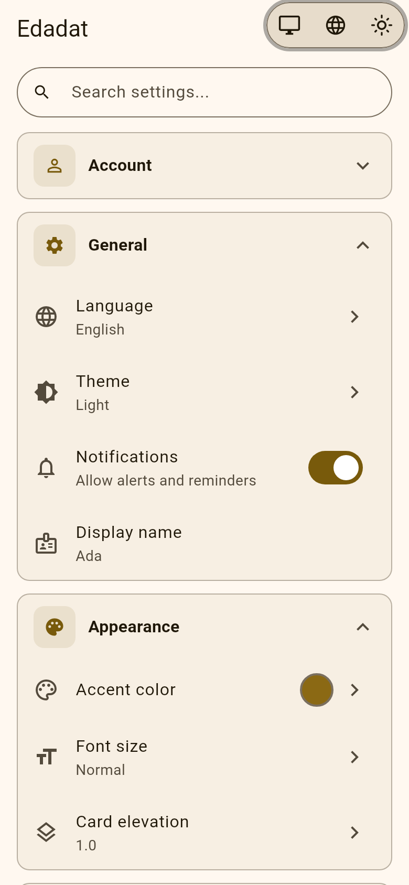
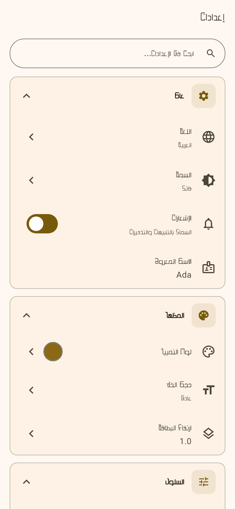
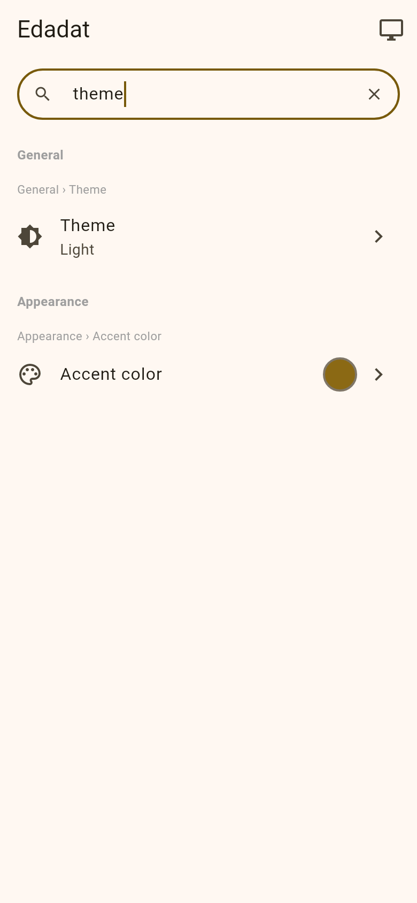
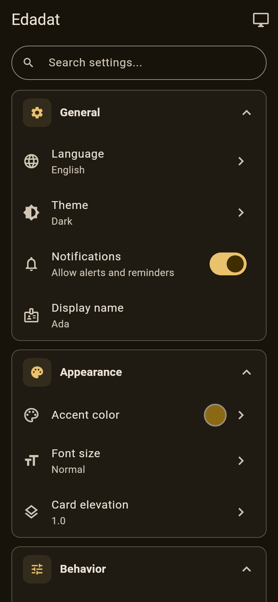
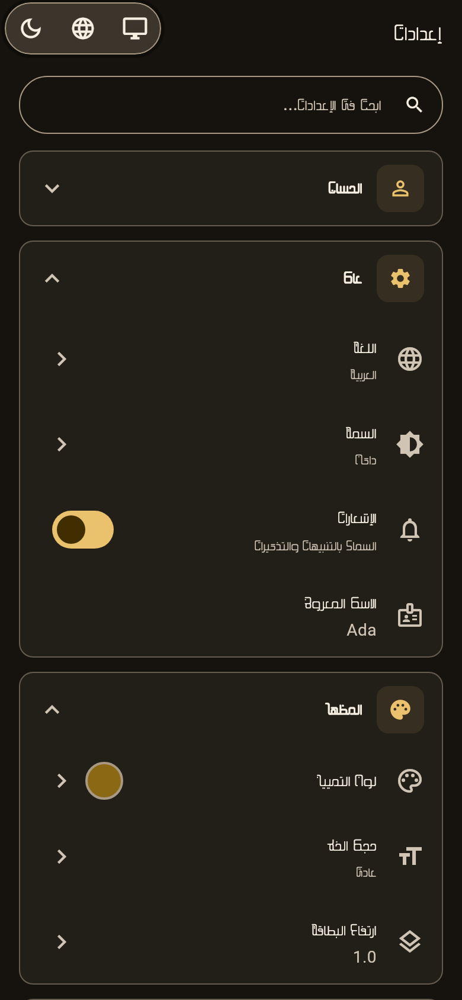
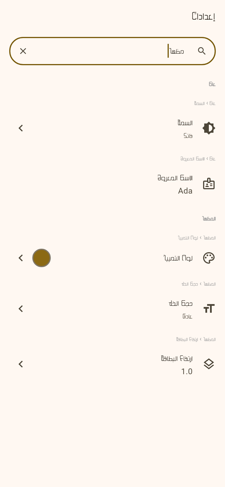

<!-- markdownlint-disable MD033 MD060 -->

<p align="center">
  
</p>

<h1 align="center">Edadat - إعدادات</h1>

<p align="center">
  <strong>flutter_settings_framework</strong><br/>
  Declarative settings for Flutter — bilingual search, Riverpod wiring,<br/>
  and ready-made tiles / registry pages.
</p>

<p align="center">
  <a href="https://zyzto.github.io/Edadat/"></a>
</p>

<p align="center">
  <a href="https://pub.dev/packages/flutter_settings_framework"></a>
  <a href="https://github.com/Zyzto/Edadat"></a>
  
  <a href="LICENSE"></a>
</p>

<p align="center">
  <strong><a href="https://zyzto.github.io/Edadat/">Live demo</a></strong>
  — open the example catalog in the browser<br/>
  <a href="https://zyzto.github.io/Edadat/">zyzto.github.io/Edadat</a>
</p>

<p align="center">
  <a href="https://zyzto.github.io/Edadat/">Live demo</a> ·
  <a href="#install">Install</a> ·
  <a href="#quick-start">Quick start</a> ·
  <a href="#screenshots">Screenshots</a> ·
  <a href="#features-at-a-glance">Features</a> ·
  <a href="#setting-types">Types</a> ·
  <a href="#example">Example</a> ·
  <a href="CHANGELOG.md">Changelog</a> ·
  <a href="VERSIONING.md">Versioning</a> ·
  <a href="README.ar.md">العربية</a> ·
  <a href="doc/i18n-ar.md">Arabic UI style</a>
</p>

<p align="center">
  The name <strong>edadat</strong> comes from Arabic
  <span dir="rtl"><strong>إعدادات</strong></span>
  (<em>iʿdādāt</em>): settings / configurations —
  plural of <span dir="rtl"><em>إعداد</em></span> (<em>iʿdād</em>).
</p>

---

## Why

Most Flutter apps grow a pile of preference notifiers, keys, and one-off tiles. Then you need:

- declarative definitions instead of per-setting boilerplate
- search that works in more than the current UI language
- a consistent settings page without rebuilding every screen

**Edadat** covers that path with a stream/callback core, a **shipped Riverpod adapter + UI**, and bilingual search indexing. Other state-management adapters are not included today (`flutter_riverpod` is a hard dependency).

On pub.dev: [`flutter_settings_framework`](https://pub.dev/packages/flutter_settings_framework) · Repo: [Zyzto/Edadat](https://github.com/Zyzto/Edadat)

---

## Screenshots

<p align="center">
  <a href="https://zyzto.github.io/Edadat/">
    
    
    
  </a>
</p>

<p align="center">
  <sub>English catalog · Arabic RTL · Bilingual search — <a href="https://zyzto.github.io/Edadat/">try them in the live demo</a></sub>
</p>

<details>
<summary>Dark theme</summary>

<p align="center">
  <a href="https://zyzto.github.io/Edadat/">
    
    
    
  </a>
</p>

<p align="center">
  <sub>English dark · Arabic dark · Arabic search</sub>
</p>

</details>

Rendered from the [`example/`](example/) catalog (`flutter test test/screenshots_test.dart`).

---

## Features at a glance

| Area | What you get |
|------|----------------|
| **Definitions** | Typed settings (`Bool`, `Enum`, `Color`, …) in a few lines |
| **Search** | Multi-language index via `PreIndexedLocalizationProvider` + synonyms |
| **Riverpod** | `initializeSettings`, `SettingsProviders`, `ref.watchSetting` / `updateSetting` |
| **UI** | Tiles, sections, persistent/compact search, `RegistrySettingsPage` |
| **Jump-to** | `SettingAnchorRegistry` scroll + highlight after search |
| **Storage** | `SharedPreferencesStorage`, or your own `SettingsStorage` |
| **Actions** | Non-persisted `ActionSetting` rows that stay searchable |

**Core:** stream/callback controller (no Riverpod import). **Shipped integration:** Riverpod adapter + Riverpod-based settings UI.

---

## Install

```yaml
dependencies:
  flutter_settings_framework: ^0.7.2
```

Or:

```bash
flutter pub add flutter_settings_framework
```

Git tag pin (see [VERSIONING.md](VERSIONING.md)):

```yaml
dependencies:
  flutter_settings_framework:
    git:
      url: https://github.com/Zyzto/edadat.git
      ref: v0.7.2
```

```dart
import 'package:flutter_settings_framework/flutter_settings_framework.dart';
```

Current version: **0.7.2**.

---

## Quick start

### 1. Define settings

```dart
import 'package:flutter/material.dart';
import 'package:flutter_settings_framework/flutter_settings_framework.dart';

const generalSection = SettingSection(
  key: 'general',
  titleKey: 'general',
  icon: Icons.settings,
  order: 0,
);

const themeModeSetting = EnumSetting(
  'theme_mode',
  defaultValue: 'system',
  titleKey: 'theme',
  options: ['system', 'light', 'dark'],
  section: 'general',
  searchTerms: {
    'en': ['theme', 'dark', 'light', 'mode'],
    'ar': ['المظهر', 'داكن', 'فاتح'],
  },
);

const notificationsSetting = BoolSetting(
  'notifications_enabled',
  defaultValue: true,
  titleKey: 'notifications',
  icon: Icons.notifications,
  section: 'general',
);

SettingsRegistry createMyRegistry() {
  return SettingsRegistry.withSettings(
    sections: [generalSection],
    settings: [themeModeSetting, notificationsSetting],
  );
}
```

### 2. Initialize (override all three providers)

```dart
Future<void> main() async {
  WidgetsFlutterBinding.ensureInitialized();

  final en = Map<String, String>.from(
    jsonDecode(await rootBundle.loadString('assets/translations/en.json')) as Map,
  );
  final ar = Map<String, String>.from(
    jsonDecode(await rootBundle.loadString('assets/translations/ar.json')) as Map,
  );

  final settings = await initializeSettings(
    registry: createMyRegistry(),
    storage: SharedPreferencesStorage(),
    localizationProvider: PreIndexedLocalizationProvider({
      'en': en,
      'ar': ar,
    }),
  );

  runApp(
    ProviderScope(
      overrides: [
        settingsControllerProvider.overrideWithValue(settings.controller),
        settingsSearchIndexProvider.overrideWithValue(settings.searchIndex),
        settingsProvidersProvider.overrideWithValue(settings),
      ],
      child: const MyApp(),
    ),
  );
}
```

### 3. Use in widgets

```dart
class MyWidget extends ConsumerWidget {
  const MyWidget({super.key});

  @override
  Widget build(BuildContext context, WidgetRef ref) {
    final enabled = ref.watchSetting(notificationsSetting);

    return SwitchSettingsTile.fromSetting(
      setting: notificationsSetting,
      title: 'notifications'.tr(),
      value: enabled,
      onChanged: (value) => ref.updateSetting(notificationsSetting, value),
    );
  }
}
```

### 4. Registry page

```dart
RegistrySettingsPage(
  registry: myRegistry,
  settings: ref.settings,
  title: 'settings'.tr(),
  searchHint: 'search_settings'.tr(),
  sectionTitleBuilder: (key) => key.tr(),
  enumLabelBuilder: (key) => key.tr(),
)
```

Search results: `ref.watch(settingsSearchResultsProvider(query))`.

---

## Setting types

| Type | Class | Example |
|------|-------|---------|
| String | `StringSetting` | User names, paths |
| Boolean | `BoolSetting` | Toggle features |
| Integer | `IntSetting` | Counts, days |
| Double | `DoubleSetting` | Scales, spacing |
| Color | `ColorSetting` | Theme colors |
| Enum | `EnumSetting` | Limited options |
| String List | `StringListSetting` | Tags, filters |
| Action | `ActionSetting` | Export, about (non-persisted) |

---

## Multi-language search

Pass `PreIndexedLocalizationProvider` at `initializeSettings` so titles, subtitles, and section titles are indexed for every locale. Add `searchTerms` for synonyms.

For Arabic UI wording (MSA tone, anti-calque habits, and a shared glossary), see [Arabic UI localization style guide](doc/i18n-ar.md).

```dart
const languageSetting = EnumSetting(
  'language',
  defaultValue: 'en',
  titleKey: 'language',
  options: ['en', 'ar'],
  searchTerms: {
    'en': ['locale', 'english', 'arabic'],
    'ar': ['لغة', 'إنجليزي', 'عربي'],
  },
);

final results = searchIndex.search('عربي');
```

Set `visible: false` on internal settings so they never appear in search (`order` alone does not hide them from `SearchIndex`).

---

## UI inventory

**Tiles:** `SettingsTile`, `SwitchSettingsTile`, `SelectSettingsTile`, `SliderSettingsTile`, `ColorSettingsTile`, `NavigationSettingsTile`, `ActionSettingsTile`, `InfoSettingsTile`

**Layout:** `SettingsSectionWidget`, `SettingsSearchBar` (`persistent` / `compact`), `SettingAnchorRegistry` / `scrollToSetting`, `SplitScreenLayout`, `RegistrySettingsPage`, `CardSettingsSection`

**Helpers:** `ref.settings`, `ref.watchSetting` / `updateSetting` / `resetSetting`, `settingsSearchResultsProvider`, `buildSearchResultWidgets`, `isSettingEnabled`

---

## Architecture

```
┌─────────────────────────────────────────────────────────────┐
│                    Your App (Widgets)                       │
└─────────────────────────────┬───────────────────────────────┘
                              │
┌─────────────────────────────▼───────────────────────────────┐
│              Riverpod adapter + settings UI                 │
│   • SettingNotifier<T> / SettingsProviders                  │
│   • RegistrySettingsPage, tiles (Riverpod-coupled)          │
└─────────────────────────────┬───────────────────────────────┘
                              │
┌─────────────────────────────▼───────────────────────────────┐
│           Core (streams / callbacks, no Riverpod)           │
│   • SettingsController · SettingsRegistry · SearchIndex     │
│   • SettingsStorage abstraction                             │
└─────────────────────────────┬───────────────────────────────┘
                              │
┌─────────────────────────────▼───────────────────────────────┐
│   SharedPreferencesStorage · MemoryStorage · custom         │
└─────────────────────────────────────────────────────────────┘
```

---

## Example

**[Live demo — zyzto.github.io/Edadat](https://zyzto.github.io/Edadat/)**

The hosted catalog is the `example/` web build. CI deploys it after tests pass
on `main`.

See [`example/`](example/) for a bilingual `RegistrySettingsPage` catalog: Bool, Enum, Color, Double, Int, String, StringList, Action, `dependsOn`, and EN/AR search. Language and theme toggles sit above the catalog (same chrome as [Safaeh](https://github.com/Zyzto/Safaeh)).

The example is package-style (web only in-tree); analyze with:

```bash
cd example && flutter pub get && dart analyze --fatal-infos && flutter test
```

`example/test/screenshots_test.dart` writes catalog PNGs to [`screenshots/`](screenshots/).

To run on a device, generate the other platforms (`flutter create . --platforms=android,ios` inside `example/`). Details: [example/README.md](example/README.md).

Package tests:

```bash
dart analyze --fatal-infos && flutter test
```

---

## Branding

The logo wordmark uses **[Baz](https://www.1001fonts.com/baz-font.html)** (Baz Light) — the same Arabic typeface as [Siglat](https://github.com/Zyzto/Siglat). The face is vendored at [`assets/fonts/baz-Light.otf`](assets/fonts/baz-Light.otf); the SVG outlines the glyphs so GitHub/pub.dev render without loading the font.

---

## Versioning

See [VERSIONING.md](VERSIONING.md) and [CHANGELOG.md](CHANGELOG.md). Tags are `vX.Y.Z` and must match `pubspec.yaml`.

---

## License

[MPL-2.0](LICENSE) — weak copyleft, commercial use allowed. Modified package files stay under MPL; your app can remain closed-source.
